<div align="center">

# 🏠 Flatfinder

### Find a London flatshare by how long it *actually* takes to get to work — not distance on a map.

[](LICENSE)
[](https://www.python.org/downloads/)
[](#do-i-need-an-api-key)
[](#get-started)



</div>

SpareRoom can filter rooms by distance, or by the commute from **one train station**. But you
don't commute to a station — you commute to **your desk**. Flatfinder searches SpareRoom and keeps
only the rooms that are a **real door-to-door journey** to *your* office (walk → tube/bus/rail →
walk), using Transport for London's official journey planner. Every morning it opens the genuinely
new matches in your browser, and never shows you the same room twice.

> **In one line:** rooms under your budget **and** under your commute — ranked by the minutes you'll
> actually spend travelling, opened fresh each day.

---

## Get started

**No account. No coding. No API key.** Download, double-click, answer three questions.

1. **Download** — green **`Code`** button (top of this page) → **Download ZIP** → unzip anywhere (e.g. Desktop).
2. **Launch it:**
   - **Windows** — double-click **`Launch Flatfinder.bat`**
   - **macOS** — right-click **`Launch Flatfinder.command`** → **Open** (first time only)

   The first launch sets itself up automatically (~1–2 min, once). If it says you need Python, it
   shows a single line to copy-paste — run it, then launch again.
3. **Answer 3 questions** — your **work postcode**, **budget**, and **max commute**. Done. It hunts and
   opens the best new rooms in your browser.

Next time, just launch it again — it only opens rooms that are **new since last time**.

> 💡 Windows: double-click **`Create Desktop Shortcut.bat`** once for a desktop icon.
> Want higher rate limits later? The menu's **“TfL key”** option walks you through getting a free key
> and **saves it forever** — you only do it once.

### If your computer shows a security warning

Free downloaded tools are unsigned, so your OS asks once — this isn't specific to Flatfinder:

- **Windows** — *“Windows protected your PC”* → **More info → Run anyway**.
- **macOS** — *“unidentified developer”* → **right-click the file → Open → Open**.

<details>
<summary><b>Developers (pip)</b></summary>

```bash
git clone <your-fork-url> flatfinder && cd flatfinder
python -m venv .venv && source .venv/bin/activate   # Windows: .venv\Scripts\Activate.ps1
pip install -e ".[dev]"
flatfinder            # interactive menu — runs the setup wizard on first launch
pytest -q
```
</details>

---

## What one run does

```
Search SpareRoom (every page, within a commute-derived radius of your office)
   → geocode each room        → TfL door-to-door journey to YOUR office
   → keep ≤ your minutes & ≤ your budget    → drop rooms you've already seen
   → (optional) AI drops obvious scams      → open the new matches in your browser
```

- **Real commute, not distance.** Each candidate is routed door-to-door to your office, arriving by
  the time you set (default 09:00 on a weekday).
- **Never shown twice.** A local database remembers every room you've opened, so each morning is only
  *new* listings — no re-scrolling the same flats.
- **Reads the whole market, politely.** Follows every SpareRoom result page (not just the first),
  with a built-in delay so it stays a good citizen.
- **Fast where it's safe to be.** Geocoding and TfL journeys run in parallel and are cached; only the
  SpareRoom fetches stay deliberately slow and polite.
- **Honest about gaps.** If TfL ever rate-limits, those rooms are flagged *unchecked* and retried —
  never silently dropped as "too far".

---

## Do I need an API key?

**No.** Flatfinder talks to TfL's journey planner **without a key** (unauthenticated requests work at
a lower rate limit, which is plenty for a personal daily hunt since journeys are cached).

Two things are **optional upgrades**, and the app tells you when they'd help:

| Optional | What it adds | How |
|---|---|---|
| **Free TfL key** | Higher rate limit — worth it for big catch-up searches or infrequent use | Menu → **TfL key** (opens the sign-up, guides you, **saves it forever**). Or during setup, or into `.env`. |
| **AI filter** | Auto-drops obvious scams / hot-bed / "curtain partition" ads | Add `DEEPSEEK_API_KEY` to `.env`, set `ai.enabled: true`. ~$1/day hard cap, tracked from real usage |

Without either, everything works — search, commute filtering, dedupe, ranking, and opening tabs.
When running keyless, Flatfinder automatically throttles its TfL requests to stay under the free
rate limit, so a big search won't error out.

---

## For developers

```bash
git clone <your-fork-url> flatfinder && cd flatfinder
python -m venv .venv && source .venv/bin/activate   # Windows: .venv\Scripts\Activate.ps1
pip install -e ".[dev]"
pytest -q
```

Common commands (also available from the interactive menu):

```bash
flatfinder                 # interactive menu (first run → setup wizard)
flatfinder setup           # re-run the setup wizard
flatfinder daily           # full daily hunt: scrape → commute → dedupe → open new tabs
flatfinder daily --dry-run # do everything except open tabs / mark seen
flatfinder run             # scrape + score, print a shortlist (no browser)
flatfinder baseline        # mark everything live now as "seen" → only NEW rooms open after
flatfinder ui              # Streamlit dashboard
flatfinder smoke-tfl --from-postcode "E2 8AA"   # test a single journey to your office
flatfinder export data/shortlist.csv
```

**Stack:** Python 3.11+, `httpx` + `beautifulsoup4` (scrape), `pydantic` (config), `sqlalchemy` +
SQLite (dedupe/cache), `typer` + `rich` (CLI), `streamlit` (dashboard).

**Layout:** `src/flatfinder/` — `scraper/` (SpareRoom), `commute/` (TfL), `geo/` (postcodes +
prefilter), `pipeline.py` (orchestration), `daily.py` (the morning workflow), `rank.py`, `ui/`.

---

## Configuration

You normally never edit config by hand — use the **Settings** menu (option 2) or `flatfinder setup`.
Everything lives in `config.yaml` (created for you from [`config.example.yaml`](config.example.yaml)
and **git-ignored**, so your office and budget never end up in a commit).

| Key | Default | What it does |
|---|---|---|
| `office.postcode` | *(set at setup)* | commute destination — rooms are routed here |
| `budget.max_pcm` / `min_pcm` | `1450` / `900` | monthly rent ceiling / floor (weekly prices auto-converted) |
| `commute.max_minutes` | `30` | door-to-door limit **and** search radius (tighter = smaller net) |
| `commute.time` | `09:00` arriving | when you need to be at your desk |
| `filter.require_living_room` | `true` | drop flats that explicitly have **no** living room (unknown kept) |
| `filter.exclude_short_term` | `true` | drop unambiguous short-term-only sublets (max term ≤ 3 months or "short term only") |
| `daily.max_tabs` | `15` | how many new rooms to open per run |
| `ai.enabled` | `false` | optional AI quality filter (needs a key) |
| `search.search_url` | `null` | paste a SpareRoom advanced-search URL to override the built-in search |

<details>
<summary><b>How the commute-driven coverage works</b></summary>

Three tiers, each cheaper than the next, all derived from your `max_minutes`:

1. **Search radius** (SpareRoom, free) — bounds what's fetched to a radius around your office
   derived from your commute budget (20 / 30 / 45 min → ~6 / 10 / 16 mi).
2. **Local prefilter** (no network) — an outer-London outcode denylist + a crow-flies cap + a rough
   public-transport estimate, to avoid spending journey lookups on the clearly-unreachable.
3. **TfL door-to-door** (the arbiter) — the real ≤ `max_minutes` test, cached by origin so re-runs
   are cheap.

Pagination follows SpareRoom's per-search `search_id` through **every** page; with incremental mode
on, runs stop at the first already-seen page, so day one backfills and every day after only touches
genuinely new rooms.
</details>

---

## Keep your settings between updates

Your `config.yaml`, `.env` (keys) and `data/` (the seen-database) are **git-ignored**, so a `git pull`
never touches them. To keep them completely *outside* the code — so re-downloading or replacing the
app folder can never lose your setup — point `FLATFINDER_HOME` at a stable folder once:

- **Windows:** `setx FLATFINDER_HOME "%USERPROFILE%\FlatfinderData"` (reopen the launcher afterwards)
- **macOS / Linux:** add `export FLATFINDER_HOME="$HOME/FlatfinderData"` to your shell profile

Flatfinder then reads/writes all personal data there and leaves the code folder pristine — update as
often as you like without re-entering your office, budget or keys.

## Updating

When a new version ships, you don't re-download anything:

- **In the app:** menu → **9 · Update** (or run `flatfinder update`). It fetches the latest release and
  installs it in place — your office, budget, keys and seen-list are all kept.
- **If you cloned with git:** just `git pull`.

## FAQ

**I only run it occasionally (say monthly) — will it choke on the backlog?** No. Every run is
bounded: it fetches details for the **newest ~80** candidates per run, and when running keyless it
**throttles TfL** to stay under the rate limit. A long gap just means "newest first, the rest skipped
this run" — never a crash or a 10-minute hang. Bump `search.max_details_per_run` if you want more per run.

**Does it work outside London?** The commute engine is TfL-specific, so it's London-only today.
Contributions to plug in other journey-planner APIs are welcome.

**Will it spam SpareRoom?** No — detail fetches are sequential and throttled by design. Use it for a
personal daily hunt, as intended.

**Where does my data go?** Nowhere. Everything (config, the seen-rooms database, logs) stays in a
local folder on your machine.

**Does it run on a Mac?** Yes — use `Launch Flatfinder.command` (see [Get started](#get-started)).

**Going on holiday without the laptop?** Vacation mode runs the hunt in the cloud (free,
GitHub Actions) and sends each new room to your phone via Telegram — see **[VACATION.md](VACATION.md)**.
You can also **change settings from the chat**: send `/menu` for a tappable settings card, or type
`/budget 1400`, `/commute 35`, `/livingroom on` — the next run applies it and confirms. Settings are
**per chat**: list several chat ids in `TELEGRAM_CHAT_ID` and each person gets their own filters and
their own shortlist.

---

## Contributing

PRs welcome! Fork it, create a branch, and open a pull request — the maintainer reviews and merges
everything, so nothing lands unchecked. See **[CONTRIBUTING.md](CONTRIBUTING.md)** for the 5-step version.

## ⚠️ Please use this responsibly

This is a **personal-use** tool for your own flat hunt. Automated access may be contrary to
SpareRoom's Terms of Service — keep the built-in delay on, don't hammer the site, don't
redistribute scraped content, and don't run it at scale. You are responsible for how you use it.
Not affiliated with SpareRoom or Transport for London.

## License

[MIT](LICENSE) — do what you like, no warranty.

---

<sub>**Keywords:** SpareRoom scraper · London flatshare finder · room to rent · house share · flatmate / roommate search · flat hunting automation · commute-based room search · door-to-door commute time · TfL journey planner API · public transport travel time · rooms under budget in London · SpareRoom automation tool · Python · rightmove/zoopla alternative for rooms. Built for anyone searching **rooms to rent in London ranked by real commute time** to their office or workplace.</sub>
